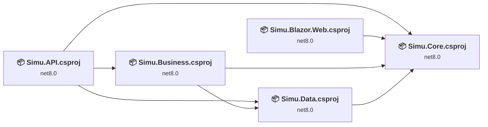
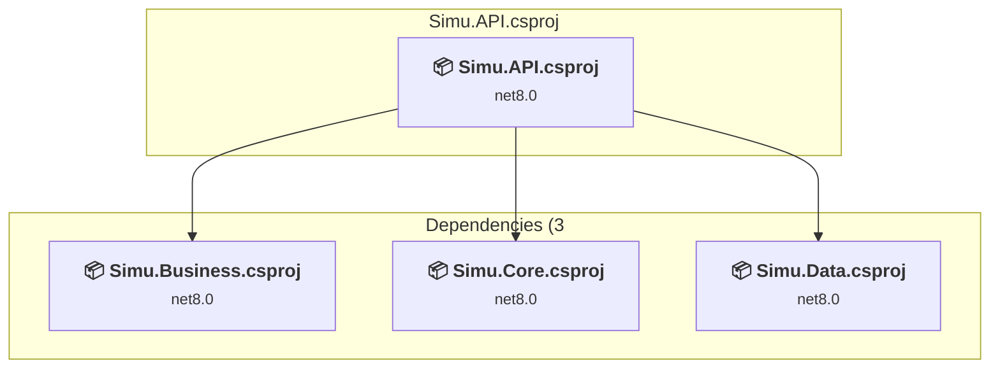
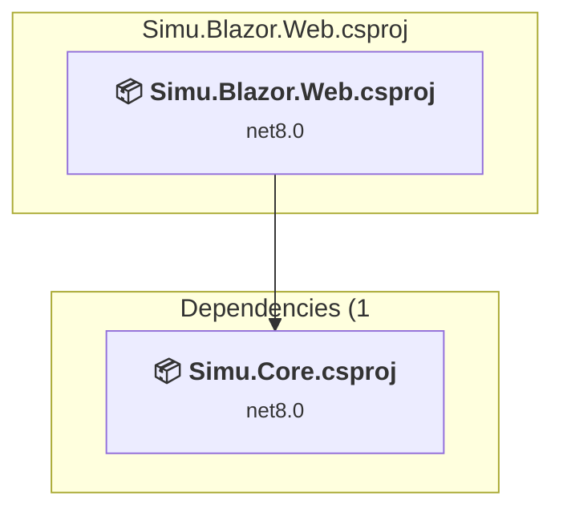
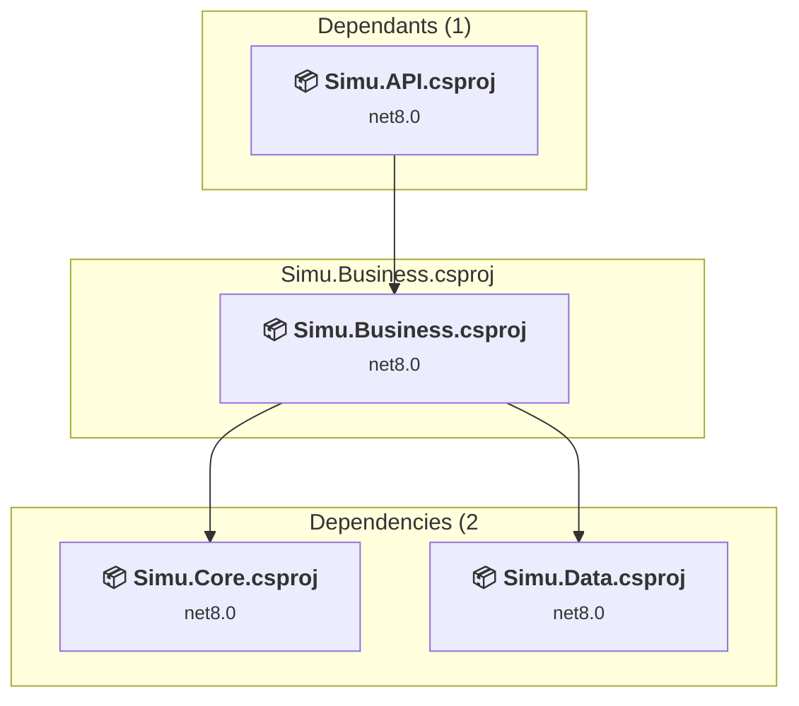
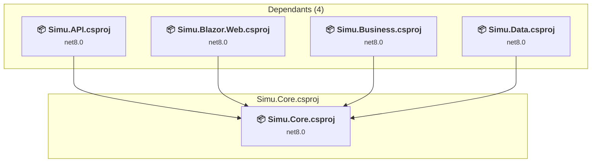
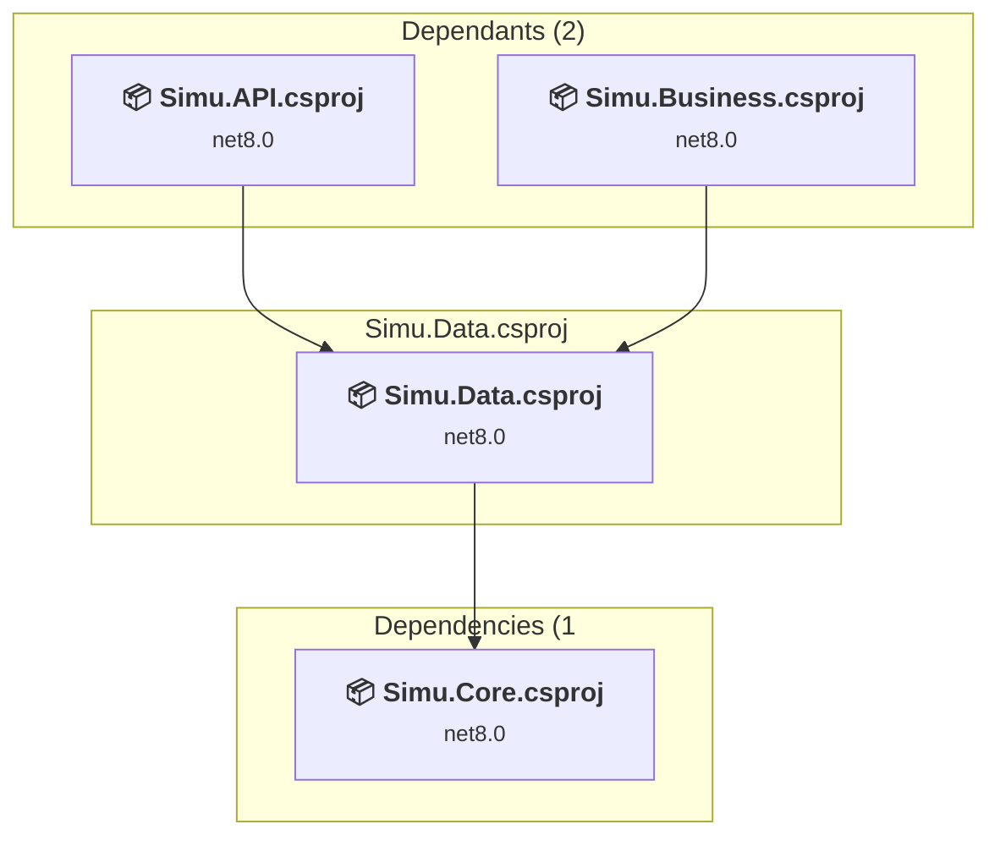

# Projects and dependencies analysis

This document provides a comprehensive overview of the projects and their dependencies in the context of upgrading to .NETCoreApp,Version=v10.0.

## Table of Contents

- [Executive Summary](#executive-Summary)
  - [Highlevel Metrics](#highlevel-metrics)
  - [Projects Compatibility](#projects-compatibility)
  - [Package Compatibility](#package-compatibility)
  - [API Compatibility](#api-compatibility)
- [Aggregate NuGet packages details](#aggregate-nuget-packages-details)
- [Top API Migration Challenges](#top-api-migration-challenges)
  - [Technologies and Features](#technologies-and-features)
  - [Most Frequent API Issues](#most-frequent-api-issues)
- [Projects Relationship Graph](#projects-relationship-graph)
- [Project Details](#project-details)

  - [Simu.API\Simu.API.csproj](#simuapisimuapicsproj)
  - [Simu.Blazor.Web\Simu.Blazor.Web.csproj](#simublazorwebsimublazorwebcsproj)
  - [Simu.Business\Simu.Business.csproj](#simubusinesssimubusinesscsproj)
  - [Simu.Core\Simu.Core.csproj](#simucoresimucorecsproj)
  - [Simu.Data\Simu.Data.csproj](#simudatasimudatacsproj)

## Executive Summary

### Highlevel Metrics

| Metric | Count | Status |
| :--- | :---: | :--- |
| Total Projects | 5 | All require upgrade |
| Total NuGet Packages | 8 | 7 need upgrade |
| Total Code Files | 41 |  |
| Total Code Files with Incidents | 6 |  |
| Total Lines of Code | 1512 |  |
| Total Number of Issues | 16 |  |
| Estimated LOC to modify | 3+ | at least 0.2% of codebase |

### Projects Compatibility

| Project | Target Framework | Difficulty | Package Issues | API Issues | Est. LOC Impact | Description |
| :--- | :---: | :---: | :---: | :---: | :---: | :--- |
| [Simu.API\Simu.API.csproj](#simuapisimuapicsproj) | net8.0 | 🟢 Low | 1 | 0 |  | AspNetCore, Sdk Style = True |
| [Simu.Blazor.Web\Simu.Blazor.Web.csproj](#simublazorwebsimublazorwebcsproj) | net8.0 | 🟢 Low | 3 | 3 | 3+ | AspNetCore, Sdk Style = True |
| [Simu.Business\Simu.Business.csproj](#simubusinesssimubusinesscsproj) | net8.0 | 🟢 Low | 1 | 0 |  | ClassLibrary, Sdk Style = True |
| [Simu.Core\Simu.Core.csproj](#simucoresimucorecsproj) | net8.0 | 🟢 Low | 0 | 0 |  | ClassLibrary, Sdk Style = True |
| [Simu.Data\Simu.Data.csproj](#simudatasimudatacsproj) | net8.0 | 🟢 Low | 3 | 0 |  | ClassLibrary, Sdk Style = True |

### Package Compatibility

| Status | Count | Percentage |
| :--- | :---: | :---: |
| ✅ Compatible | 1 | 12.5% |
| ⚠️ Incompatible | 0 | 0.0% |
| 🔄 Upgrade Recommended | 7 | 87.5% |
| ***Total NuGet Packages*** | ***8*** | ***100%*** |

### API Compatibility

| Category | Count | Impact |
| :--- | :---: | :--- |
| 🔴 Binary Incompatible | 0 | High - Require code changes |
| 🟡 Source Incompatible | 0 | Medium - Needs re-compilation and potential conflicting API error fixing |
| 🔵 Behavioral change | 3 | Low - Behavioral changes that may require testing at runtime |
| ✅ Compatible | 1819 |  |
| ***Total APIs Analyzed*** | ***1822*** |  |

## Aggregate NuGet packages details

| Package | Current Version | Suggested Version | Projects | Description |
| :--- | :---: | :---: | :--- | :--- |
| Microsoft.AspNetCore.Components.WebAssembly | 8.0.0 | 10.0.5 | [Simu.Blazor.Web.csproj](#simublazorwebsimublazorwebcsproj) | NuGet package upgrade is recommended |
| Microsoft.AspNetCore.Components.WebAssembly.DevServer | 8.0.0 | 10.0.5 | [Simu.Blazor.Web.csproj](#simublazorwebsimublazorwebcsproj) | NuGet package upgrade is recommended |
| Microsoft.AspNetCore.OpenApi | 8.0.0 | 10.0.5 | [Simu.API.csproj](#simuapisimuapicsproj) | NuGet package upgrade is recommended |
| Microsoft.EntityFrameworkCore | 8.0.0 | 10.0.5 | [Simu.Business.csproj](#simubusinesssimubusinesscsproj) [Simu.Data.csproj](#simudatasimudatacsproj) | NuGet package upgrade is recommended |
| Microsoft.EntityFrameworkCore.SqlServer | 8.0.0 | 10.0.5 | [Simu.Data.csproj](#simudatasimudatacsproj) | NuGet package upgrade is recommended |
| Microsoft.EntityFrameworkCore.Tools | 8.0.0 | 10.0.5 | [Simu.Data.csproj](#simudatasimudatacsproj) | NuGet package upgrade is recommended |
| Swashbuckle.AspNetCore | 6.4.6 |  | [Simu.API.csproj](#simuapisimuapicsproj) | ✅Compatible |
| System.Net.Http.Json | 8.0.0 | 10.0.5 | [Simu.Blazor.Web.csproj](#simublazorwebsimublazorwebcsproj) | NuGet package upgrade is recommended |

## Top API Migration Challenges

### Technologies and Features

| Technology | Issues | Percentage | Migration Path |
| :--- | :---: | :---: | :--- |

### Most Frequent API Issues

| API | Count | Percentage | Category |
| :--- | :---: | :---: | :--- |
| T:System.Uri | 2 | 66.7% | Behavioral Change |
| M:System.Uri.#ctor(System.String) | 1 | 33.3% | Behavioral Change |

## Projects Relationship Graph

Legend:
📦 SDK-style project
⚙️ Classic project

## Project Details

### Simu.API\Simu.API.csproj

#### Project Info

- **Current Target Framework:** net8.0
- **Proposed Target Framework:** net10.0
- **SDK-style**: True
- **Project Kind:** AspNetCore
- **Dependencies**: 3
- **Dependants**: 0
- **Number of Files**: 4
- **Number of Files with Incidents**: 1
- **Lines of Code**: 418
- **Estimated LOC to modify**: 0+ (at least 0.0% of the project)

#### Dependency Graph

Legend:
📦 SDK-style project
⚙️ Classic project

### API Compatibility

| Category | Count | Impact |
| :--- | :---: | :--- |
| 🔴 Binary Incompatible | 0 | High - Require code changes |
| 🟡 Source Incompatible | 0 | Medium - Needs re-compilation and potential conflicting API error fixing |
| 🔵 Behavioral change | 0 | Low - Behavioral changes that may require testing at runtime |
| ✅ Compatible | 399 |  |
| ***Total APIs Analyzed*** | ***399*** |  |

### Simu.Blazor.Web\Simu.Blazor.Web.csproj

#### Project Info

- **Current Target Framework:** net8.0
- **Proposed Target Framework:** net10.0
- **SDK-style**: True
- **Project Kind:** AspNetCore
- **Dependencies**: 1
- **Dependants**: 0
- **Number of Files**: 9
- **Number of Files with Incidents**: 2
- **Lines of Code**: 12
- **Estimated LOC to modify**: 3+ (at least 25.0% of the project)

#### Dependency Graph

Legend:
📦 SDK-style project
⚙️ Classic project

### API Compatibility

| Category | Count | Impact |
| :--- | :---: | :--- |
| 🔴 Binary Incompatible | 0 | High - Require code changes |
| 🟡 Source Incompatible | 0 | Medium - Needs re-compilation and potential conflicting API error fixing |
| 🔵 Behavioral change | 3 | Low - Behavioral changes that may require testing at runtime |
| ✅ Compatible | 161 |  |
| ***Total APIs Analyzed*** | ***164*** |  |

### Simu.Business\Simu.Business.csproj

#### Project Info

- **Current Target Framework:** net8.0
- **Proposed Target Framework:** net10.0
- **SDK-style**: True
- **Project Kind:** ClassLibrary
- **Dependencies**: 2
- **Dependants**: 1
- **Number of Files**: 12
- **Number of Files with Incidents**: 1
- **Lines of Code**: 395
- **Estimated LOC to modify**: 0+ (at least 0.0% of the project)

#### Dependency Graph

Legend:
📦 SDK-style project
⚙️ Classic project

### API Compatibility

| Category | Count | Impact |
| :--- | :---: | :--- |
| 🔴 Binary Incompatible | 0 | High - Require code changes |
| 🟡 Source Incompatible | 0 | Medium - Needs re-compilation and potential conflicting API error fixing |
| 🔵 Behavioral change | 0 | Low - Behavioral changes that may require testing at runtime |
| ✅ Compatible | 227 |  |
| ***Total APIs Analyzed*** | ***227*** |  |

### Simu.Core\Simu.Core.csproj

#### Project Info

- **Current Target Framework:** net8.0
- **Proposed Target Framework:** net10.0
- **SDK-style**: True
- **Project Kind:** ClassLibrary
- **Dependencies**: 0
- **Dependants**: 4
- **Number of Files**: 18
- **Number of Files with Incidents**: 1
- **Lines of Code**: 319
- **Estimated LOC to modify**: 0+ (at least 0.0% of the project)

#### Dependency Graph

Legend:
📦 SDK-style project
⚙️ Classic project

### API Compatibility

| Category | Count | Impact |
| :--- | :---: | :--- |
| 🔴 Binary Incompatible | 0 | High - Require code changes |
| 🟡 Source Incompatible | 0 | Medium - Needs re-compilation and potential conflicting API error fixing |
| 🔵 Behavioral change | 0 | Low - Behavioral changes that may require testing at runtime |
| ✅ Compatible | 433 |  |
| ***Total APIs Analyzed*** | ***433*** |  |

### Simu.Data\Simu.Data.csproj

#### Project Info

- **Current Target Framework:** net8.0
- **Proposed Target Framework:** net10.0
- **SDK-style**: True
- **Project Kind:** ClassLibrary
- **Dependencies**: 1
- **Dependants**: 2
- **Number of Files**: 6
- **Number of Files with Incidents**: 1
- **Lines of Code**: 368
- **Estimated LOC to modify**: 0+ (at least 0.0% of the project)

#### Dependency Graph

Legend:
📦 SDK-style project
⚙️ Classic project

### API Compatibility

| Category | Count | Impact |
| :--- | :---: | :--- |
| 🔴 Binary Incompatible | 0 | High - Require code changes |
| 🟡 Source Incompatible | 0 | Medium - Needs re-compilation and potential conflicting API error fixing |
| 🔵 Behavioral change | 0 | Low - Behavioral changes that may require testing at runtime |
| ✅ Compatible | 599 |  |
| ***Total APIs Analyzed*** | ***599*** |  |

